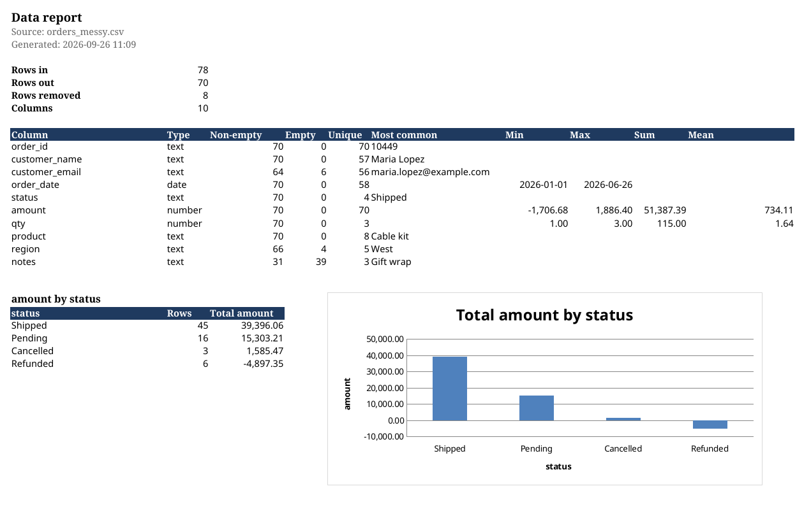

# tidycsv

Clean a messy CSV and turn it into an Excel report in one command.

```
tidycsv orders_messy.csv -o orders_report.xlsx
```

```
orders_messy.csv: 78 rows in, 70 rows out, 10 columns
  - headers normalised (10)
  - whitespace trimmed (105)
  - placeholder values blanked (12)
  - empty rows removed (3)
  - empty columns removed (1)
  - order_date: parsed as dates (75)
  - amount: parsed as numbers (34)
  - status: case variants unified (38)
  - duplicate rows removed (5)
  types: order_id=text, customer_name=text, customer_email=text, order_date=date, status=text, amount=number, ...
wrote orders_report.xlsx
```



## What it fixes

| In the CSV | In the report |
| --- | --- |
| ` Order ID`, `Amount ($)`, `Unnamed: 8` | `order_id`, `amount`, dropped if empty |
| `  Maria Lopez`, `Leave at door ` | trimmed |
| `N/A`, `null`, `-`, `?` | empty cell |
| `$1,386.10`, `(45.00)`, `2.500,00`, `12%` | `1386.1`, `-45`, `2500`, `12` as real numbers |
| `2026-03-04`, `3/4/2026`, `4 Mar 2026`, `March 4, 2026` | one date column, formatted `yyyy-mm-dd` |
| `shipped`, `Shipped `, `SHIPPED` | `Shipped` |
| blank rows, exact duplicate rows | removed (counted in the Changes sheet) |

ZIP codes, phone numbers and anything ending in `_id` are kept as text so leading zeros survive.

## What you get

One `.xlsx` with three sheets:

- **Data** – the cleaned rows as an Excel table: frozen header, filters, sensible column widths, number and date formats.
- **Summary** – rows in/out, one line per column (type, empty count, unique values, most common value, min/max/sum/mean), plus a totals table and bar chart for the most useful category × amount pair. Pick your own with `--group-by` and `--sum`.
- **Changes** – every transformation that was applied, with counts. Nothing happens silently.

The workbook opens on the Summary sheet and prints landscape, one page wide.

## Install

Python 3.10 or newer.

```
pip install git+https://github.com/djoguzhan1/tidycsv
```

or, for development:

```
git clone https://github.com/djoguzhan1/tidycsv
cd tidycsv
pip install -e ".[dev]"
```

## Usage

```
tidycsv INPUT.csv [-o OUTPUT.xlsx] [options]

  -o, --output FILE      Excel file to write (default: INPUT_report.xlsx)
  --group-by COLUMN      category column for the totals table and chart
  --sum COLUMN           numeric column to total per category
  --dayfirst             read ambiguous dates as day/month/year (UK, EU)
  --keep-duplicates      do not remove exact duplicate rows
  --keep-case            do not unify Shipped / shipped / SHIPPED
  --encoding ENC         input encoding (default: try utf-8, cp1252, latin-1)
  --delimiter CHAR       field delimiter (default: detect)
```

Column names on the command line can be spelled the way they appear in the file (`--sum "Amount ($)"`) or the way they appear in the report (`--sum amount`).

From Python:

```python
import pandas as pd
from tidycsv import clean, write_report

frame = pd.read_csv("orders_messy.csv", dtype=str, keep_default_na=False)
result = clean(frame)
print(result.rows_in, "->", result.rows_out)
for change in result.changes:
    print(change.column, change.action, change.count)

write_report(result, "orders_report.xlsx", source_name="orders_messy.csv", group_by="region", sum_column="amount")
```

## How type detection works

A column becomes a number if at least 90 % of its non-empty values parse as one (currency symbols, thousands separators, `(negative)` and `%` are allowed). Otherwise it becomes a date if 90 % of values match one of the known formats. Everything else stays text. The threshold is a keyword argument on `clean()` if your data is dirtier than that.

Case unification only touches text columns with 25 or fewer distinct values, so it fixes `Status` and `Region` without ever touching names or notes.

## Limits

- One header row, one table per file. Multi-line headers and merged report layouts are out of scope.
- Dates without a year, or with time zones, are left as text.
- Very wide files (hundreds of columns) work but the Summary sheet gets long.

## Development

```
pip install -e ".[dev]"
ruff check .
pytest
tidycsv examples/orders_messy.csv -o /tmp/report.xlsx
```

`examples/orders_messy.csv` is a generated sample with every kind of mess listed above; `examples/orders_report.xlsx` is what the tool produces from it.

## License

MIT © 2026 Oğuzhan Salatan
